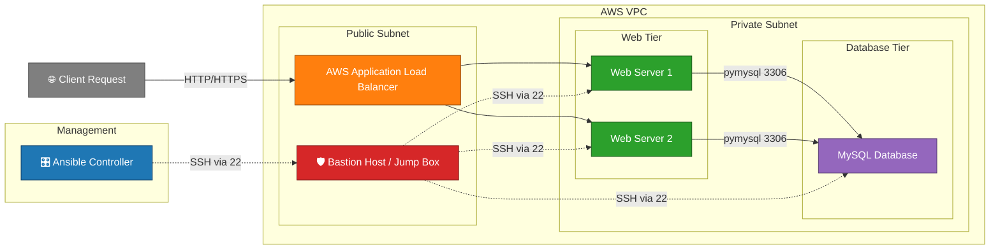

```mermaid
flowchart LR
    %% Nodes
    USER[🌐 Client Request]
    
    subgraph Control_Plane [Management]
        ANSIBLE[🎛️ Ansible Controller]
    end

    subgraph AWS_VPC [AWS VPC]
        
        subgraph PUBLIC_SUBNET [Public Subnet]
            BASTION[🛡️ Bastion Host / Jump Box]
            ALB[AWS Application Load Balancer]
        end

        subgraph PRIVATE_SUBNET [Private Subnet]
            subgraph WEB_TIER [Web Tier]
                WEB1[Web Server 1]
                WEB2[Web Server 2]
            end

            subgraph DB_TIER [Database Tier]
                DB["MySQL Database"]
            end
        end
    end

    %% Traffic Flow
    USER -->|HTTP/HTTPS| ALB
    ALB --> WEB1
    ALB --> WEB2
    WEB1 -->|pymysql 3306| DB
    WEB2 -->|pymysql 3306| DB

    %% Ansible Control Plane (w/ Bastion / ProxyJump)
    ANSIBLE -.->|SSH via 22| BASTION
    BASTION -.->|SSH via 22| WEB1
    BASTION -.->|SSH via 22| WEB2
    BASTION -.->|SSH via 22| DB

    %% Styling
    classDef controller fill:#1f77b4,color:#fff,stroke:#0d3b66
    classDef lb fill:#ff7f0e,color:#fff,stroke:#8c4407
    classDef web fill:#2ca02c,color:#fff,stroke:#185918
    classDef db fill:#9467bd,color:#fff,stroke:#553972
    classDef user fill:#7f7f7f,color:#fff,stroke:#4c4c4c
    classDef bastion fill:#d62728,color:#fff,stroke:#791616

    class ANSIBLE controller
    class ALB lb
    class WEB1,WEB2 web
    class DB db
    class USER user
    class BASTION bastion

```