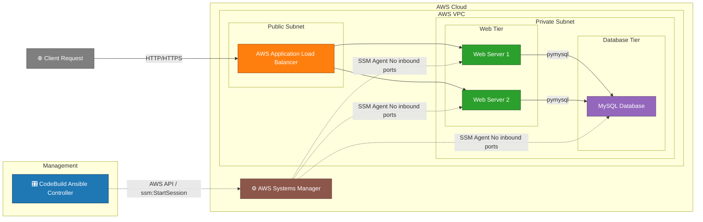

```mermaid
flowchart LR
    %% Nodes
    USER[🌐 Client Request]
    
    subgraph Control_Plane [Management]
        ANSIBLE[🎛️ CodeBuild Ansible Controller]
    end

    subgraph AWS_Cloud [AWS Cloud]
        SSM[⚙️ AWS Systems Manager]
        
        subgraph AWS_VPC [AWS VPC]
            subgraph PUBLIC_SUBNET [Public Subnet]
                ALB[AWS Application Load Balancer]
            end

            subgraph PRIVATE_SUBNET [Private Subnet]
                subgraph WEB_TIER [Web Tier]
                    WEB1[Web Server 1]
                    WEB2[Web Server 2]
                end

                subgraph DB_TIER [Database Tier]
                    DB[MySQL Database]
                end
            end
        end
    end

    %% Traffic Flow
    USER -->|HTTP/HTTPS| ALB
    ALB --> WEB1
    ALB --> WEB2
    WEB1 -->|pymysql| DB
    WEB2 -->|pymysql| DB

    %% Ansible Control Plane via SSM
    ANSIBLE -.->|AWS API / ssm:StartSession| SSM
    SSM -.->|SSM Agent No inbound ports| WEB1
    SSM -.->|SSM Agent No inbound ports| WEB2
    SSM -.->|SSM Agent No inbound ports| DB

    %% Styling
    classDef controller fill:#1f77b4,color:#fff,stroke:#0d3b66
    classDef lb fill:#ff7f0e,color:#fff,stroke:#8c4407
    classDef web fill:#2ca02c,color:#fff,stroke:#185918
    classDef db fill:#9467bd,color:#fff,stroke:#553972
    classDef user fill:#7f7f7f,color:#fff,stroke:#4c4c4c
    classDef ssm fill:#8c564b,color:#fff,stroke:#5c352c

    class ANSIBLE controller
    class ALB lb
    class WEB1,WEB2 web
    class DB db
    class USER user
    class SSM ssm

```